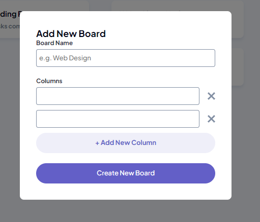
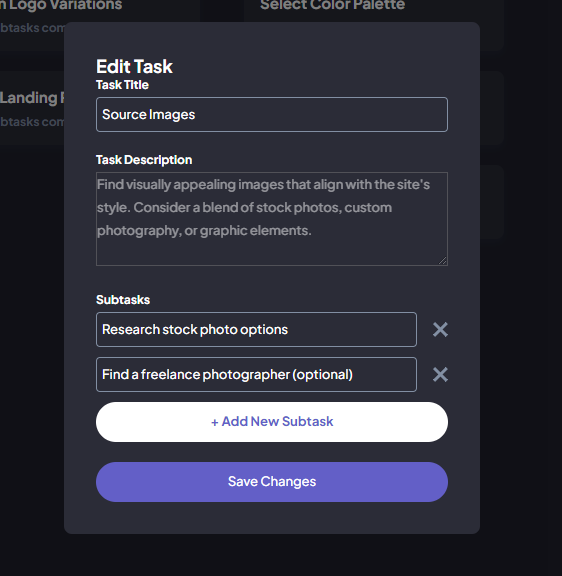
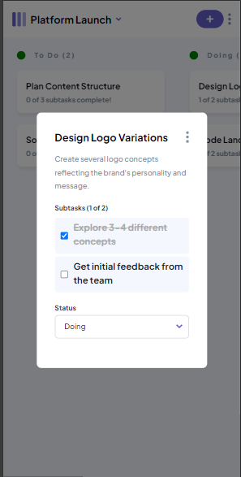
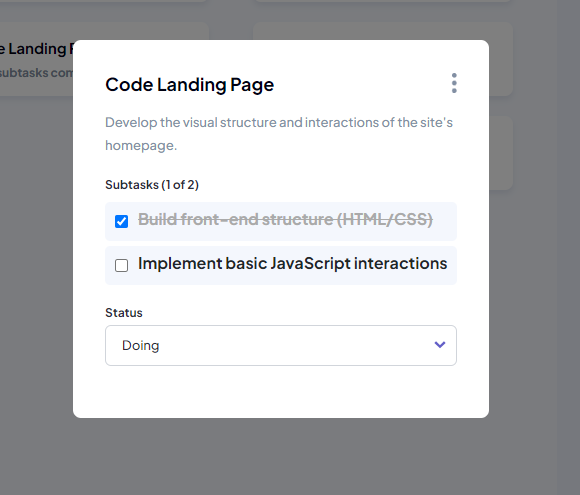

# Kanban Management App

 
 
 

## Project Summary

The Kanban Task Management Platform provides a structured and streamlined workspace for organising projects and tasks. Designed to enhance productivity and collaboration, this platform leverages Vue.js's reactivity,  SCSS for easy stylesheet management, Laravel's backend power, and MySQL for reliable data storage.

## Key Features 

* **Task & Board Management (Vue.js, Laravel, MySQL):** Create, edit, and delete boards to organise various work projects. Add tasks within boards, track their progress, and customise columns to reflect workflows.
* **Dynamic Interface (Vue.js):** Vue.js offers a clean, reusable component structure and state management to ensure the Kanban board dynamically updates for easy collaboration.
* **Customisable Columns (Laravel, MySQL):**Configure board columns to match your workflows and update column settings effortlessly.
* **Sidebar Navigation (Vue.js):**switch between boards with an intuitive sidebar.
* **Light/Dark Mode (SCSS, JavaScript):**Customize your workspace with flexible visual preferences.

## Why These Features Are Used

These features aim to make task management simple and efficient. Kanban's visual design, coupled with customisable workflows and dynamic user interactions, promotes greater organisation and improved project visibility.  The combined technologies create a powerful, user-friendly, and highly adaptable application suited for both individual and team use.

## Screenshots

## Link to Demo: 

